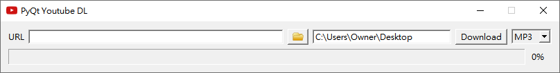

# PyQt Youtube DL
PyQt Youtube DL provides an easy and intuitive interface for youtube-dl using PyQt6.

# How to Pack Code into Executable file
1. Download Pyinstaller
2. Download this project
3. Change cwd to the project directory
4. Use command `pyinstaller pyqt-youtube-dl.spec` to generate a executable file
5. The executable file will appear at ./dist/pyqt-ydl.exe

# Test Environment
+ Windows 10
+ Python 3.9.1
+ Pyinstaller 4.3

# Package Requirements
+ PyQt6==6.1.0
+ youtube-dl==2020.12.14

# License
This project is under the [MIT License](./LICENSE).
